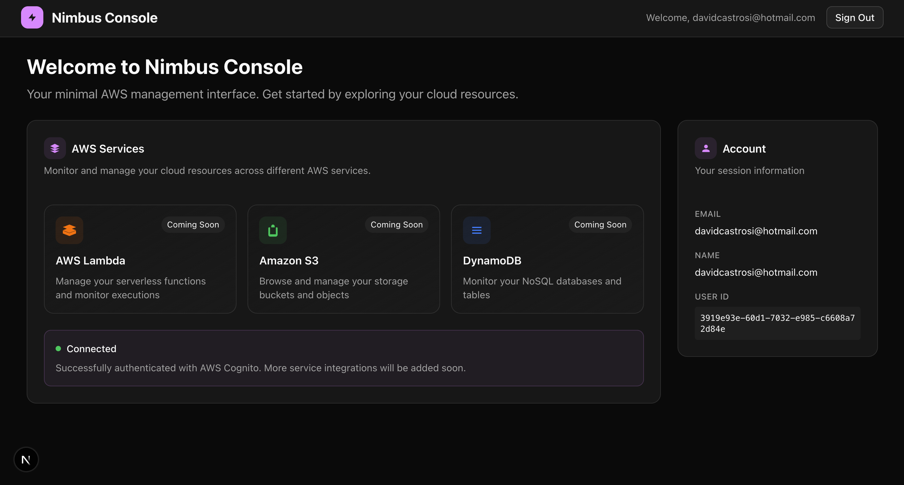

# 🌀 Nimbus - The Fast AWS Console

## 📸 Preview


_Lightning-fast login with seamless Cognito authentication flow_


_Instant dashboard loading with real-time AWS service monitoring_

> **⚡ Performance-First AWS Console - Currently in Development**

A **lightning-fast AWS Management Console** built with Next.js 15 that prioritizes speed and user experience. Nimbus delivers instant interactions, zero-latency navigation, and a delightfully smooth interface for managing your essential AWS services without the bloat.

## ⚡ Why Nimbus is Faster

Experience AWS management at the speed of thought:

- **Zero Backend Latency** - Direct browser-to-AWS communication eliminates proxy delays
- **Instant Page Transitions** - Next.js App Router with optimized routing and prefetching
- **Optimistic UI Updates** - Actions feel immediate with smart local state management
- **Minimal Bundle Size** - Only loads what you need, when you need it
- **Smart Caching** - Intelligent resource caching reduces redundant API calls

## �🚀 Getting Started

First, run the development server:

```bash
pnpm dev
```

Open [http://localhost:3000](http://localhost:3000) with your browser to see the result.

You can start editing the page by modifying `app/page.tsx`. The page auto-updates as you edit the file.

## 🛠 Performance-First Tech Stack

- **Frontend**: Next.js 15 with App Router for instant navigation
- **Styling**: Tailwind CSS + shadcn/ui for optimized bundle size
- **Package Manager**: pnpm for faster installs and smaller node_modules
- **AWS Integration**: Direct AWS SDK calls for zero proxy latency
- **Authentication**: Streamlined Cognito + STS flow for quick login
- **State Management**: Optimistic UI patterns for immediate feedback

## 📁 Project Structure

```
src/
├── app/              # Next.js App Router pages
│   ├── login/        # Authentication pages
│   └── layout.tsx    # Root layout
├── components/       # Reusable UI components
│   └── ui/          # shadcn/ui components
└── lib/             # Utility functions and configurations
```

## ⚡ Current Performance Features

This blazing-fast console is **actively under development**. Core features implemented:

- ✅ **Instant Authentication** - Streamlined Cognito flow with automatic token refresh
- ✅ **Zero-Latency Navigation** - Pre-loaded routes and optimistic state management
- ✅ **Smart Credential Management** - Seamless STS integration with background refresh
- ✅ **Lightning-Fast UI** - Modern interface optimized for speed and productivity
- 🚧 **Real-Time Service Dashboards** - Live monitoring for Lambda, API Gateway, S3, DynamoDB
- 🚧 **Instant Search** - Sub-50ms resource discovery across all services
- 🚧 **Optimistic Mutations** - Actions complete before AWS confirms them

## 🚀 Quick Start

### Prerequisites

- Node.js 18+ and pnpm
- AWS Account with Cognito User Pool and Identity Pool configured
- Basic understanding of AWS IAM and Cognito

### Setup

1. **Clone and install dependencies:**

   ```bash
   git clone <repository-url>
   cd nimbus
   pnpm install
   ```

2. **Configure AWS Cognito:**
   Follow our detailed [Cognito Setup Guide](./docs/COGNITO_SETUP.md) to set up:

   - Cognito User Pool with Hosted UI
   - Cognito Identity Pool for AWS access
   - IAM roles with appropriate permissions

3. **Environment configuration:**

   ```bash
   cp .env.example .env.local
   # Edit .env.local with your Cognito configuration
   ```

4. **Start development server:**

   ```bash
   pnpm dev
   ```

5. **Test authentication:**
   - Navigate to http://localhost:3000/login
   - Click "Continue with AWS Cognito"
   - Complete the sign-in flow

### Authentication Flow

The authentication system implements a secure OAuth2 flow:

1. **Login**: Redirects to Cognito Hosted UI
2. **Callback**: Handles authorization code exchange
3. **Token Management**: Stores JWT tokens securely in session storage
4. **AWS Access**: Exchanges tokens for temporary AWS credentials
5. **Auto-refresh**: Automatically refreshes expired tokens
