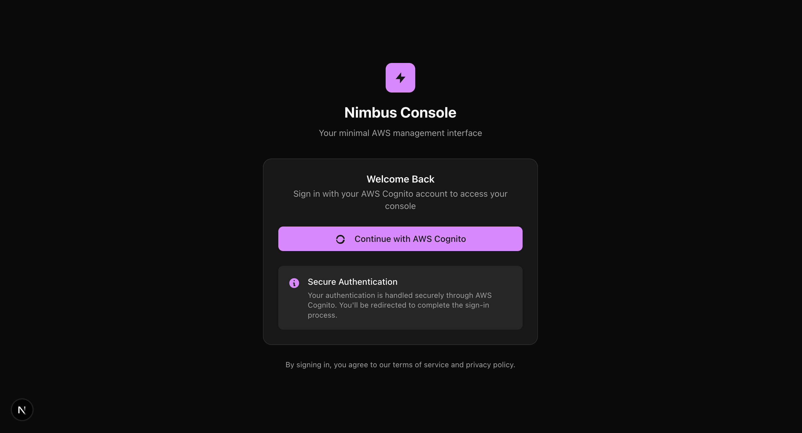

# 🌀 Nimbus - Mini AWS Console

> **🚧 Currently in Development**

A custom, focused AWS Management Console built with Next.js. This project provides a fast, opinionated, serverless-first UI for the AWS services I use most, while serving as a deep learning exercise in AWS APIs, authentication flows, and modern frontend architecture.

## 🎯 Project Goal

Build a lightweight AWS Console that:

- ✅ Authenticates securely using **Cognito + STS** (temporary credentials)
- ✅ Interacts **directly with AWS services via SDK** for a snappy UX
- ✅ Provides a **better user experience** for core services (Lambda, API Gateway, DynamoDB, S3, CloudFormation)
- ✅ Serves as a **learning project** to deepen AWS and frontend engineering skills
- ✅ Doubles as a **portfolio piece** showcasing system design and cloud integration

For detailed project overview and architecture, see [`overview.md`](./overview.md).

## � Preview


_The sleek login interface with AWS Cognito authentication_

## �🚀 Getting Started

First, run the development server:

```bash
pnpm dev
```

Open [http://localhost:3000](http://localhost:3000) with your browser to see the result.

You can start editing the page by modifying `app/page.tsx`. The page auto-updates as you edit the file.

## 🛠 Tech Stack

- **Frontend**: Next.js 15 with App Router
- **Styling**: Tailwind CSS + shadcn/ui components
- **Package Manager**: pnpm (as specified in project guidelines)
- **AWS Integration**: AWS SDK for JavaScript
- **Authentication**: AWS Cognito + STS for temporary credentials

## 📁 Project Structure

```
src/
├── app/              # Next.js App Router pages
│   ├── login/        # Authentication pages
│   └── layout.tsx    # Root layout
├── components/       # Reusable UI components
│   └── ui/          # shadcn/ui components
└── lib/             # Utility functions and configurations
```

## 🎯 Current Status

This project is **actively under development**. Core features being implemented:

- [ ] AWS Cognito authentication flow
- [ ] Service dashboards (Lambda, API Gateway, S3, DynamoDB)
- [ ] Real-time AWS resource monitoring
- [ ] Optimistic UI updates with TanStack Query
